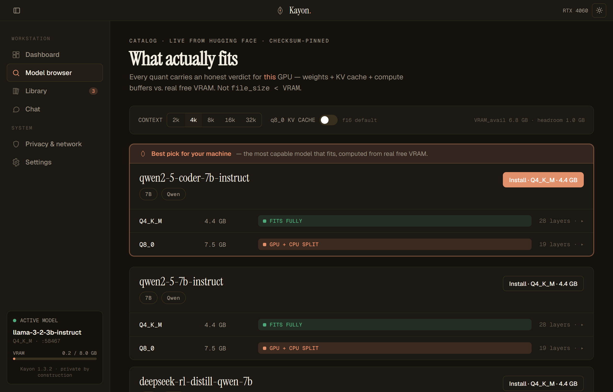
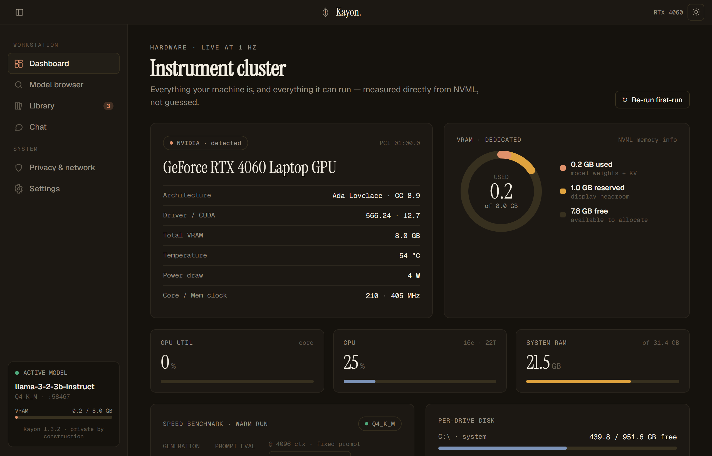
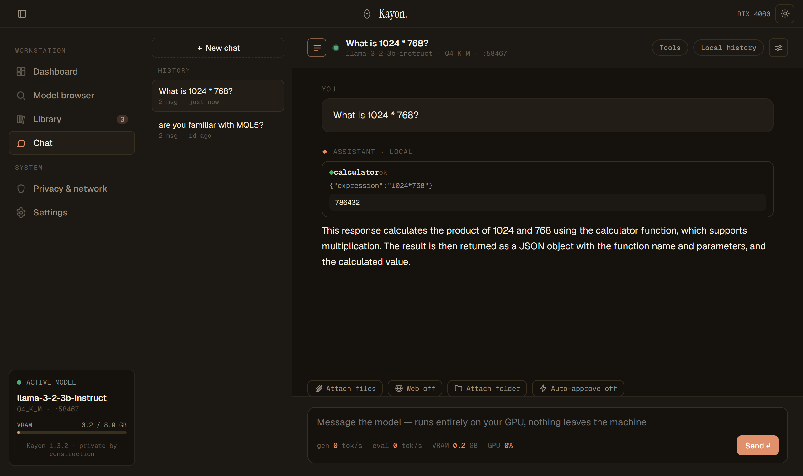

<div align="center">


# Kayon

**An honest, private, local-LLM workstation for Windows + NVIDIA.**

[](https://github.com/thelabs-id/kayon/releases/latest)
[](LICENSE)
[](https://github.com/thelabs-id/kayon/releases/latest)
[](https://www.rust-lang.org)
[](https://tauri.app)

Most local-LLM apps decide whether a model "fits" your GPU by comparing its file size to your VRAM.
That's a lie. It ignores the KV cache, the compute buffers, and the memory your display already took.
Kayon does the real arithmetic, gives you a verdict for every quant, and runs the whole thing on your
machine. No account, no cloud, no telemetry unless you switch it on.

**[Download for Windows](https://github.com/thelabs-id/kayon/releases/latest)**



</div>

---

## Why Kayon

### Honest fit, not `file_size < VRAM`

Every quant of every model gets a verdict computed for *your* GPU at *your* context length. The
arithmetic behind it is weights + KV cache + compute buffers + display headroom, measured against
actual free VRAM:

| Verdict | Meaning |
|---|---|
| `FITS_FULLY` | Runs entirely on the GPU, with room to spare |
| `FITS_TIGHT` | Fits, but with little headroom |
| `GPU_CPU_SPLIT` | Partially offloaded. Runs, slower |
| `CPU_ONLY` | Won't fit on the GPU; fits in RAM |
| `EXCEEDS_MACHINE` | Won't run here |
| `UNVERIFIED_ARCH` | Non-standard attention (SSM/linear/hybrid), so the KV cache can't be modelled honestly. Kayon says "unverified" rather than invent a number |

Expand any quant to see the arithmetic. When nothing fits, Kayon says so plainly instead of crowning a
model that can't run.

### Adopt your Ollama models in place

Kayon finds your Ollama store and hard-links the blobs into its library. No copy, no re-download, zero
bytes moved. It takes Ollama's blob digest as the checksum for free, and flags any model whose
architecture needs a newer runtime. Deleting Kayon's link never touches Ollama's blob.

### Private by construction

No account. No cloud. Telemetry is off by default, and when you do turn it on you see the literal
payload before anything leaves. Every outbound request in the app funnels through one instrumented
choke point and lands in a network log you can read.

---

## Download

**[Get the latest release](https://github.com/thelabs-id/kayon/releases/latest)** and run
`Kayon_<version>_x64-setup.exe`, then launch Kayon from the Start menu. The llama.cpp CUDA runtime
ships inside the installer, so chat and the benchmark work immediately. No separate download, no
environment variables, no Python.

You need Windows 10 or 11, x64. An NVIDIA GPU and driver are optional: without one Kayon still runs
and gives you RAM-based verdicts instead of pretending. [Ollama](https://ollama.com) is optional too,
and only if you want Kayon to adopt models you already have.

> [!NOTE]
> The installer isn't code-signed yet, so Windows SmartScreen will warn *"Windows protected your PC."*
> Click **More info**, then **Run anyway**. Code signing is on the roadmap.

Upgrading is just running the newer installer over the old one. Your library, chat history, and
settings survive.

---

## Screenshots

<table>
<tr>
<td width="50%">

Your hardware, measured straight from NVML at 1 Hz. Not guessed.



</td>
<td width="50%">

Local chat with an agentic tool loop. Every tool call shows up inline.



</td>
</tr>
</table>

---

## What it does

- Per-quant fit verdicts with the full breakdown, at any context length, with an f16 / q8_0 KV-cache
  toggle.
- A catalog discovered from Hugging Face at launch. Every quant's real SHA-256 and byte size come
  pinned from Git-LFS metadata, so learning a hash costs one small JSON call instead of a 4 GB
  download.
- Downloads that resume, with pause and cancel. Nothing enters your library without matching its
  pinned hash.
- Ollama adoption by hard link, with a copy fallback when the store sits on another volume.
- llama.cpp `llama-server` (CUDA) supervised as a sidecar, launched with exactly the `n_gpu_layers`
  and context the verdict promised.
- Chat sessions saved in local SQLite. Reopen any of them and keep going; each carries its own system
  prompt and sampling params.
- Agentic tools, described below.
- A privacy surface: a network log accounting for every outbound request, and telemetry that shows you
  its payload before it sends.

---

## Tools

When a loaded model's GGUF chat template actually supports tool calling (detected at load, never
guessed), Chat offers a built-in tool set through a server-side agent loop. The model's tool calls run
locally, results feed back, and the loop continues until a final answer. Every call, with its name,
arguments and result, is rendered inline and persisted with the message, so saved history stays
auditable.

The built-in set is `calculator` (a deterministic evaluator, no `eval`), `read_file`, `list_dir`,
`write_file`, `read_selection`, a Python `code` interpreter, and web `search` / `fetch_url`.
`read_file` pulls text out of PDFs, refuses other binaries with a clear message instead of feeding the
model garbage, and forgives a truncated or approximate filename.

**Session workspace and artifacts.** Every chat has a workspace: a folder you attach, or an
auto-created `~/.kayon/workspace/<session>/`. Attach files and they're copied in; files the model
creates land there as artifacts. The filesystem and code tools work only inside it. `..`, absolute
paths, and symlink escapes (including a symlinked write target) are all refused.

**Viewing artifacts and documents.** A Files panel lists the workspace, and a click opens the file in
place: markdown, text and code, images, real PDF pages, and HTML. Two things make this different from
a normal preview. It is fully offline, so the PDF engine and every asset it needs ship in the
installer and a document is never sent anywhere to be looked at. And it never executes an artifact:
HTML renders in a frame with an opaque origin, no network, and no scripts. That last part is a
deliberate trade. A content policy stops a page from fetching, but nothing stops a script from
navigating itself to `https://somewhere/?your=data`, and a navigation is not a fetch, so no policy
catches it. Running an artifact's JavaScript and promising no silent network are mutually exclusive
here, and the promise wins. So a chart or React artifact renders as static markup, the viewer says on
the artifact which scripts it refused to run and which remote URLs it will not load, and Save a copy
lets you run it in a browser you trust.

**Web is opt-in, per session.** A Web toggle, off by default, gates `search` and `fetch_url`.
DuckDuckGo is the default provider: no key, no account, straight from your machine, and every query
lands in the network log. `fetch_url` is SSRF-guarded. The host is parsed with the same parser the HTTP
client uses, resolved, and refused if it's loopback, private, or link-local; the vetted IP is then
pinned for the connection so DNS can't rebind under it, and every redirect hop is re-checked.

**Side effects ask first.** `code` always requires a per-call Approve or Deny. `write_file` asks only
when it's writing into a folder you attached, so artifacts in the auto-workspace appear without a
click. An off-by-default auto-approve overrides both.

> [!IMPORTANT]
> The confirmation is the security boundary. The `code` tool runs an isolated-mode, cwd-in-workspace,
> output-capped, killed-on-timeout Python subprocess, but it is honestly **not a sandbox**: approved
> code runs with your OS permissions. A real WASM or OS-jail sandbox is a post-v1 goal. Approve only
> what you trust.

MCP and user-defined tool servers are a planned extension. The built-in set comes first.

---

## Architecture

| Layer | Tech |
|---|---|
| Core | Rust. NVML probe, GGUF reader, the fit engine, resumable checksummed downloads, SQLite (`rusqlite`), ed25519 catalog verification, llama-server supervisor |
| Shell | Tauri 2, a native WebView2 window over the Rust core |
| UI | React + TypeScript (Vite): dashboard, model browser, library, chat, privacy, settings |
| Runtime | Prebuilt llama.cpp `llama-server` (CUDA) as a sidecar, driven over its OpenAI-compatible HTTP API |
| Catalog | Live from Hugging Face, checksum-pinned. An ed25519-signed catalog ships as the offline anchor |

The app starts its local API on `127.0.0.1:9518` on a background thread and renders the UI in the
window, so no browser is involved. That same API can serve the UI standalone, which is how the app
gets driven in automated end-to-end tests.

<details>
<summary><b>Repository layout</b></summary>

```
src-tauri/            Rust core
  src/
    probe/            NVML + system telemetry
    gguf/             GGUF header reader
    fit/              the fit engine
    catalog/          bundled anchor, verify, parse
    discovery/        live Hugging Face catalog discovery
    download/         resumable, checksummed
    library/          index, deterministic paths
    ollama/           discover, adopt (hard link)
    runtime/          llama-server sidecar supervisor
    tools/            built-in tool set + executor
    agent/            server-side agentic tool loop
    telemetry/        opt-in gate + outbound network log
    db/               SQLite (rusqlite)
    ipc/              typed command/response contract
    bin/catgen.rs     catalog generator (auto-discovery)
    bin/catsign.rs    sign the bundled catalog
  catalog/            bundled catalog.json + .sig
src/                  React + TypeScript UI (Vite)
```

</details>

---

## Building from source

Just want to use Kayon? Take the [installer](#download). This section is for building it yourself.

You'll need Windows 10/11 x64, Rust (stable), Node.js 18+, and a llama.cpp `llama-server.exe` (a CUDA
build, on NVIDIA). An NVIDIA GPU with its driver, and Ollama, are both optional.

```bash
# Build the installer
cd src && npm install && npm run build     # build the UI once
cd ..
src/node_modules/.bin/tauri build          # -> src-tauri/target/release/bundle/nsis/Kayon_<version>_x64-setup.exe
```

```bash
# Or run it in development
cd src && npm install && npm run build
cd ../src-tauri && cargo run --bin kayon   # the desktop window
# cargo run --bin server                   # just the API + UI on http://127.0.0.1:9518
```

For hot-reload UI work, run `npm run dev` in `src/` (Vite on :3000, proxying `/api` to :9518).

> [!NOTE]
> The *installer* bundles `llama-server.exe` (CUDA) as a Tauri resource, so it works out of the box.
> When *building from source* that CUDA binary isn't committed, because it's a large artifact. Put it
> in `src-tauri/binaries/llama/` before `tauri build`, or point `KAYON_LLAMA_SERVER` at it. The
> resolver checks the env var, then the bundled resource, then the dev path, then `PATH`.

Tests:

```bash
cd src-tauri && cargo test    # fit golden cases, catalog signature/tamper, tool scoping, SSRF guard
```

<details>
<summary><b>Catalog tooling</b></summary>

The catalog is discovered live from Hugging Face at runtime. It isn't hand-curated, and it isn't
fetched from any Kayon-hosted file. On launch, in the background, Kayon queries the most-downloaded
GGUF models from a trusted allow-list of quantizers (default: `bartowski`), pins each real checksum
and byte size from HF's Git-LFS metadata (the LFS `oid` *is* the SHA-256), and reads the architecture
from a range-fetched header. Results cache to `~/.kayon/catalog/discovered.json`.

A signed catalog still ships as the offline anchor, generated by the same code path:

```bash
cargo run --bin catgen -- auto [per_author] [author,...]   # regenerate the bundled anchor from HF
cargo run --bin catsign -- pubkey                          # print the baked-in verifying key
cargo run --bin catsign -- sign                            # sign -> catalog/catalog.json.sig
```

Discovery is a normal, logged network call, and you can turn it off: set the `catalog_auto_refresh`
preference to `off` to stay on the bundled or cached catalog.

On trust: runtime-discovered entries are pinned to Hugging Face's published hash and enforced by the
download checksum gate, but they aren't Kayon-signed like the bundled anchor. Hugging Face is already
the download origin, so this keeps trust with a single party. It's a deliberate tradeoff.

</details>

---

## Honest tradeoffs

Decisions worth stating plainly, rather than leaving you to find them:

- Code execution isn't sandboxed in v1. It's confirmation-gated, isolated-mode, cwd-scoped and killed
  on timeout, but approved code has your OS permissions. The UI says so rather than dressing it up as
  isolation. A WASM or OS-jail sandbox is the post-v1 hardening.
- Discovered catalog entries aren't Kayon-signed. They're pinned to Hugging Face's hash and enforced
  by the checksum gate; the bundled anchor stays signed.
- The catalog signing key isn't in source. It comes from `KAYON_CATALOG_SEED` or a gitignored key
  file, and the verifying key is baked into the binary. In production it belongs in a secret store.
- Fit constants (CUDA overhead, compute buffer, headroom) ship at conservative defaults. On-device
  calibration through the benchmark is a follow-up.
- Chat is a hand-rolled streaming client over the OpenAI-compatible endpoint, not a chat library.
- Tool-call traces persist per message. Summarized long-term memory and cross-chat recall aren't in
  this build.
- Windows and NVIDIA only in v1. No macOS or AMD, no multi-GPU offload, no multimodal, no serving.

For what changed in each version, see the [Releases](https://github.com/thelabs-id/kayon/releases)
page.

---

## License

Kayon is released under the **[MIT License](LICENSE)**.

It bundles third-party components under their own permissive licenses: llama.cpp (MIT), Tauri
(MIT/Apache-2.0), the Rust crates, and the fonts. See
**[THIRD-PARTY-NOTICES.md](THIRD-PARTY-NOTICES.md)**.

Model weights are not bundled. Kayon downloads models when you ask it to and verifies them against a
pinned checksum. Each model carries its own license from its source.

<div align="center">
<sub><i>Kayon</i>: the Tree-of-Life figure a dalang plants center-screen to frame the world of the play.</sub>
</div>
